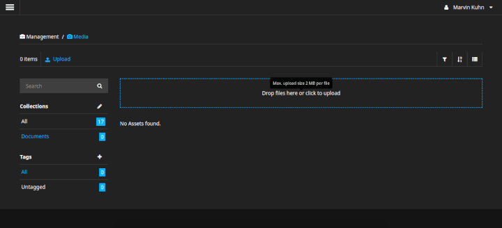

# NEOS office thumbnails generator
[]()
[]()
[]()

This NEOS CMS Plugin is for generating thumbnails of office documents.

## Installation

This package can be installed through Composer.
```bash
composer require breadlesscode/neos-office-thumbnails
```

## Requirements
 - [LibreOffice](https://libreoffice.org/) for the convertion
 - PHP >= 7.1

## Configuration

```yaml

Neos:
  Media:
    thumbnailGenerators:
      Breadlesscode\Domain\Model\ThumbnailGenerator\OfficeThumbnailGenerator:
        priority: 120
        timeout: 120 # timeout of the convertionb process
        binPath: 'libreoffice' # path to the libreoffice binary
```

## Screenshot


## License

The MIT License (MIT). Please see [License File](LICENSE) for more information.